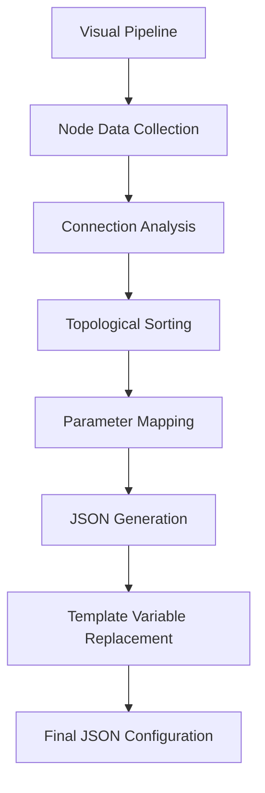
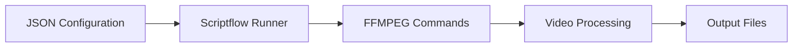

# JSON Configuration Format

The JSON configuration format is the executable representation of your visual pipeline. It's generated automatically from your node-based workflow and can be executed by the scriptflow.js runner.

## What is JSON?

JSON (JavaScript Object Notation) is a lightweight data format used to represent your video processing pipeline in a structured, machine-readable way. The visual node editor automatically converts your pipeline into JSON format.

## How It Works

### Generation Process



1. **Node Collection**: All nodes on the canvas are collected
2. **Connection Analysis**: Node connections are analyzed to determine dependencies
3. **Topological Sorting**: Nodes are sorted in execution order
4. **Parameter Mapping**: Node parameters are mapped to JSON format
5. **Template Replacement**: Template variables (`{{key}}`) are replaced with actual values
6. **JSON Generation**: Final JSON configuration is created

### Execution Flow



## JSON Structure

The JSON configuration follows this structure:

```json
{
  "script_key_1": {
    "parameter1": "value1",
    "parameter2": "value2"
  },
  "script_key_2": {
    "parameter1": "value1",
    "parameter2": "value2"
  }
}
```

### Script Keys

- **Format**: Node type with optional numeric suffix (e.g., `ff_scale`, `ff_scale_2`)
- **Uniqueness**: Each node instance gets a unique key
- **Ordering**: Keys are ordered by execution dependencies

### Parameters

- **Mapping**: GUI parameter names map to script parameter names
- **Values**: Parameter values from node inputs
- **Template Variables**: `{{key}}` syntax is replaced with Data Store values

## What It's Used For

### Primary Uses

1. **Pipeline Execution**: The JSON is executed by scriptflow.js to process videos
2. **External Execution**: Copy JSON for command-line execution
3. **Pipeline Sharing**: Share pipeline configurations with others
4. **Version Control**: Store pipeline configurations in version control
5. **Automation**: Use JSON in automated workflows

### Execution Methods

- **Visual Editor**: Run directly from the application
- **Command Line**: Use scriptflow.js with JSON file
- **API Integration**: Send JSON to processing API
- **Batch Processing**: Process multiple files with same JSON

## Template Variable Replacement

Before execution, template variables are replaced:

```
{{width}} → 1920
{{fps}} → 30
{{DATETIME}} → 2024-01-15T14:30:45.123Z
{{RANDOM_COLOUR_HEX}} → #a3f2c1
```

### Mathematical Expressions

Template variables support mathematical expressions:

```
{{width * 2}} → 3840
{{height / 2}} → 540
{{(width + height) / 2}} → 1500
```

## Viewing JSON

### JSON Modal

1. Click the "JSON" button in the toolbar
2. View formatted JSON configuration
3. Copy JSON to clipboard
4. Use for external execution

### JSON Updates

- JSON updates automatically as you modify the pipeline
- Changes are reflected in real-time
- Template variables are replaced when viewing

## Pipeline Validation

Before JSON generation, the pipeline is validated:

- **Required Parameters**: All required parameters must be set
- **Connections**: Input connections must be valid
- **Circular Dependencies**: Circular dependencies are detected and prevented
- **Node Definitions**: All nodes must have valid definitions

## Execution Order

Nodes are executed in dependency order:

1. **Input Nodes**: Processed first (no dependencies)
2. **Processing Nodes**: Processed in dependency order
3. **Output Nodes**: Processed last (depend on all previous nodes)

## Best Practices

- **Review JSON**: Check generated JSON before execution
- **Template Variables**: Use template variables for dynamic values
- **Version Control**: Store JSON configurations for version control
- **Documentation**: Document complex JSON configurations
- **Testing**: Test JSON with sample files before batch processing

## Notes

- JSON is generated automatically - no manual editing required
- Template variables are replaced at execution time
- JSON structure matches scriptflow.js requirements
- Invalid pipelines cannot generate valid JSON
