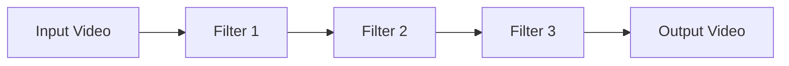
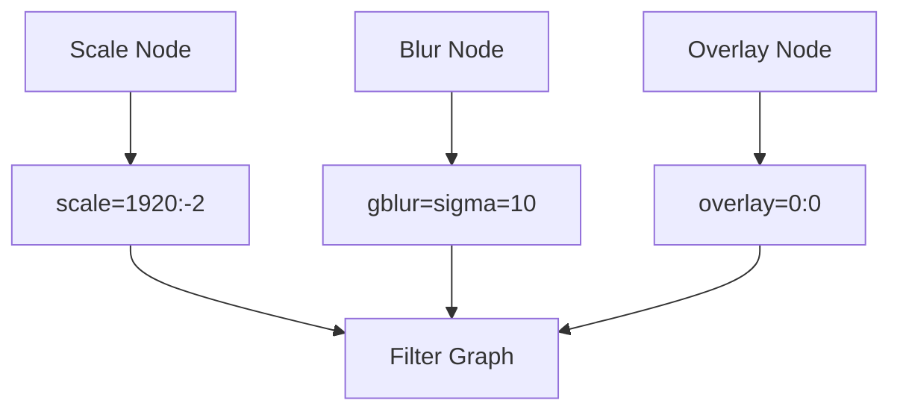
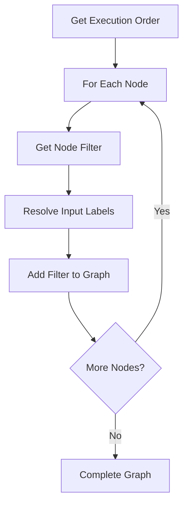

# Filter Graphs

FFMPEG filter graphs are the core mechanism STREAMLINE uses to process video. This document explains how filter graphs work and how STREAMLINE constructs them.

## What are Filter Graphs?

Filter graphs are FFMPEG's way of chaining multiple video/audio processing operations into a single, efficient pipeline.

### Basic Concept



Each filter transforms the video, and the output of one filter becomes the input of the next.

## Filter Graph Syntax

### Simple Filter Chain

```bash
-vf "scale=1920:-2,gblur=sigma=10,overlay=0:0"
```

Filters are separated by commas, executed left to right.

### Complex Filter Graph

For multiple inputs or branching:

```bash
-filter_complex "[0:v]scale=1920:-2[scaled];[scaled]gblur=sigma=10[blurred];[blurred][1:v]overlay=0:0[out]"
```

### Filter Graph Components

**Input Labels:**
- `[0:v]` - Video from first input
- `[0:a]` - Audio from first input
- `[1:v]` - Video from second input

**Intermediate Labels:**
- `[scaled]` - Result after scaling
- `[blurred]` - Result after blurring

**Output Labels:**
- `[out]` - Final output

## STREAMLINE Filter Graph Construction

### Node to Filter Mapping

Each node contributes filters to the graph:



### Filter Graph Building Process

1. **Start with Input**: Begin with input video stream
2. **Add Node Filters**: Append each node's filter
3. **Chain Filters**: Connect filters sequentially
4. **Handle Branches**: Manage parallel processing
5. **Complete Graph**: Finalize output mapping

## Filter Graph Examples

### Simple Pipeline

**Pipeline:**
```
Input → Scale → Output
```

**Filter Graph:**
```
[0:v]scale=1920:-2,setdar=16/9,setsar=1/1[out]
```

**FFMPEG Command:**
```bash
ffmpeg -i input.mp4 -vf "scale=1920:-2,setdar=16/9,setsar=1/1" output.mp4
```

### Complex Pipeline

**Pipeline:**
```
Input → Scale → Blur → Overlay (with logo) → Output
```

**Filter Graph:**
```
[0:v]scale=1920:-2[scaled];[scaled]gblur=sigma=10[blurred];[blurred][1:v]overlay=0:0[out]
```

**FFMPEG Command:**
```bash
ffmpeg -i input.mp4 -i logo.png -filter_complex "[0:v]scale=1920:-2[scaled];[scaled]gblur=sigma=10[blurred];[blurred][1:v]overlay=0:0[out]" -map "[out]" output.mp4
```

## Filter Graph Construction Algorithm

### Step-by-Step Process



### Label Management

**Input Labels:**
- Track which streams feed into each node
- Map node outputs to next node inputs
- Handle multiple inputs (overlay, stack, etc.)

**Output Labels:**
- Create intermediate labels for chaining
- Final output label for mapping
- Manage label uniqueness

## Advanced Filter Graphs

### Parallel Processing

**Branching:**
```
[0:v]split[main][copy];[main]scale=1920:-2[scaled];[copy]crop=100:100[cropped]
```

**Merging:**
```
[scaled][cropped]overlay=0:0[out]
```

### Multiple Streams

**Video and Audio:**
```
[0:v]scale=1920:-2[v];[0:a]volume=0.5[a]
```

**Mapping:**
```
-map "[v]" -map "[a]"
```

## Filter Graph Optimization

### Efficiency Strategies

1. **Minimize Labels**: Use minimal intermediate labels
2. **Combine Filters**: Merge compatible filters when possible
3. **Optimize Order**: Arrange filters for efficiency
4. **Reduce Passes**: Single pass when possible

### Performance Considerations

- **Filter Complexity**: Complex filters take more time
- **Stream Count**: More streams increase processing
- **Resolution**: Higher resolution = more processing
- **Filter Order**: Order affects performance

## Node Filter Generation

### Filter String Creation

Each node's `executeFilterGraph` method:

1. **Receives Parameters**: Node configuration
2. **Validates Inputs**: Check required inputs
3. **Generates Filter**: Create FFMPEG filter string
4. **Returns Result**: Filter graph result object

### Filter Graph Result

```typescript
{
  filterGraph: "scale=1920:-2,setdar=16/9",
  inputLabels: ["[v]"],
  outputLabel: "[v]",
  streamType: "video"
}
```

## Error Handling

### Invalid Filter Graphs

**Detection:**
- FFMPEG validation
- Filter syntax checking
- Stream compatibility

**Recovery:**
- Clear error messages
- Filter graph debugging
- User notification

## Best Practices

1. **Understand Filters**: Learn FFMPEG filter syntax
2. **Test Incrementally**: Test filters one at a time
3. **Monitor Performance**: Watch execution time
4. **Optimize Graphs**: Minimize filter complexity
5. **Handle Errors**: Graceful error handling

## Next Steps

- Learn about [FFMPEG Integration](/docs/technical-details/ffmpeg-integration) - FFMPEG usage
- Explore [Workflow Execution](/docs/technical-details/workflow-execution) - Execution details
- Understand [Node Reference](/docs/node-reference/ff_input) - Individual node filters
