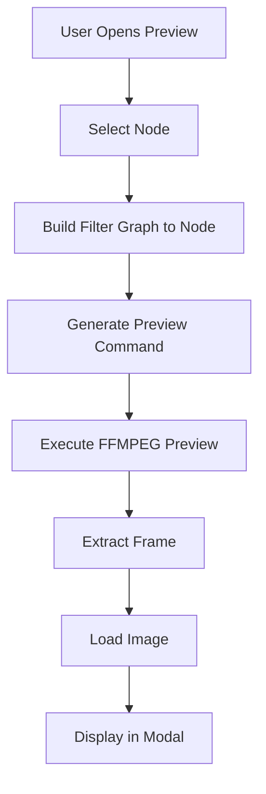
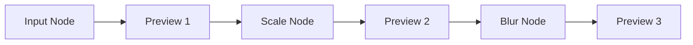

# Preview Generation

STREAMLINE's preview system generates real-time preview images showing how your video will look after processing.

## Preview System Overview



## How Previews Work

### Preview Generation Process

1. **Node Selection**: User selects node to preview
2. **Filter Graph Building**: Build filter graph up to selected node
3. **Frame Extraction**: Extract frame from video
4. **Image Generation**: FFMPEG generates preview image
5. **Image Loading**: Load image into preview modal
6. **Display**: Show preview with zoom/pan controls

### Preview Command Generation

**Basic Preview:**
```bash
ffmpeg -i input.mp4 -vf "scale=1920:-2" -frames:v 1 -f image2 preview.png
```

**Time-Based Preview:**
```bash
ffmpeg -i input.mp4 -ss 00:00:05 -vf "scale=1920:-2" -frames:v 1 -f image2 preview.png
```

## Preview Cascading

### Cascading Through Pipeline

Previews cascade through the pipeline:



**How It Works:**
- Each node's preview shows result up to that node
- Preview includes all previous node transformations
- Changes to earlier nodes update later previews

## Frame Selection

### Frame Selection Methods

**First Frame:**
- Frame 0 (beginning of video)
- Fastest to generate
- Good for static content

**Middle Frame:**
- Middle of video duration
- Representative of content
- Good for general preview

**Custom Frame:**
- User-selected frame number
- Specific time position
- Useful for specific moments

**Time Position:**
- Specific time (e.g., 00:00:05)
- Frame-accurate selection
- Good for dynamic content

## Preview Quality

### Quality Settings

**Low Quality:**
- Faster generation
- Lower resolution
- Good for quick iteration

**Medium Quality:**
- Balanced speed/quality
- Moderate resolution
- Default setting

**High Quality:**
- Slower generation
- Full resolution
- Best for final checks

### Quality Impact

- **Generation Time**: Higher quality = slower
- **File Size**: Higher quality = larger images
- **Accuracy**: Higher quality = more accurate preview

## Preview Caching

### Cache System

**Cache Strategy:**
- Cache preview images by node and frame
- Invalidate cache when nodes change
- Reuse cached images when possible

**Cache Benefits:**
- Faster preview updates
- Reduced FFMPEG calls
- Better performance

## Audio Preview

### Audio Waveform

For audio nodes:
- **Waveform Display**: Visual audio representation
- **Time-Based**: Shows audio over time
- **Interactive**: Click to scrub playback

### Audio Generation

**Waveform Generation:**
1. Extract audio stream
2. Generate waveform data
3. Render waveform visualization
4. Display in preview modal

## Preview Service

### Preview Image Service

The `previewImageService` manages:
- Preview generation requests
- Preview caching
- Preview updates
- Preview cleanup

### Service Methods

- **generatePreview**: Generate preview for node
- **getPreview**: Get cached preview
- **clearCache**: Clear preview cache
- **updatePreview**: Update preview when node changes

## Preview Update Triggers

### Automatic Updates

Previews update when:
- Node parameters change
- Nodes are connected/disconnected
- Pipeline structure changes
- Preview settings change

### Manual Updates

Users can:
- Click refresh button
- Change preview node
- Adjust preview settings
- Force preview regeneration

## Performance Optimization

### Optimization Strategies

1. **Caching**: Cache preview images
2. **Lazy Generation**: Generate on demand
3. **Quality Settings**: Use appropriate quality
4. **Frame Selection**: Choose efficient frames
5. **Background Processing**: Generate in background

### Performance Considerations

- **File Size**: Larger files = slower previews
- **Filter Complexity**: Complex filters = slower
- **Resolution**: Higher resolution = slower
- **System Resources**: CPU and memory usage

## Preview Limitations

### Known Limitations

- **Single Frame**: Preview shows one frame only
- **Quality Difference**: Preview may differ from final output
- **Generation Time**: Complex pipelines take longer
- **Resource Usage**: Preview generation uses resources

### Workarounds

- Use lower quality for faster iteration
- Preview at specific frames for accuracy
- Disable preview when not needed
- Use final execution for exact output

## Best Practices

1. **Use Preview Frequently**: Preview as you build
2. **Adjust Quality**: Use appropriate quality setting
3. **Select Frames**: Choose representative frames
4. **Cache Effectively**: Let cache work for you
5. **Final Check**: Use high quality for final preview

## Next Steps

- Learn about [Preview System](/docs/user-guide/preview-system) - Preview features
- Explore [Modal Interface](/docs/user-guide/preview-system/modal-interface) - Preview controls
- Understand [Video Monitors](/docs/user-guide/preview-system/video-monitors) - Color analysis
